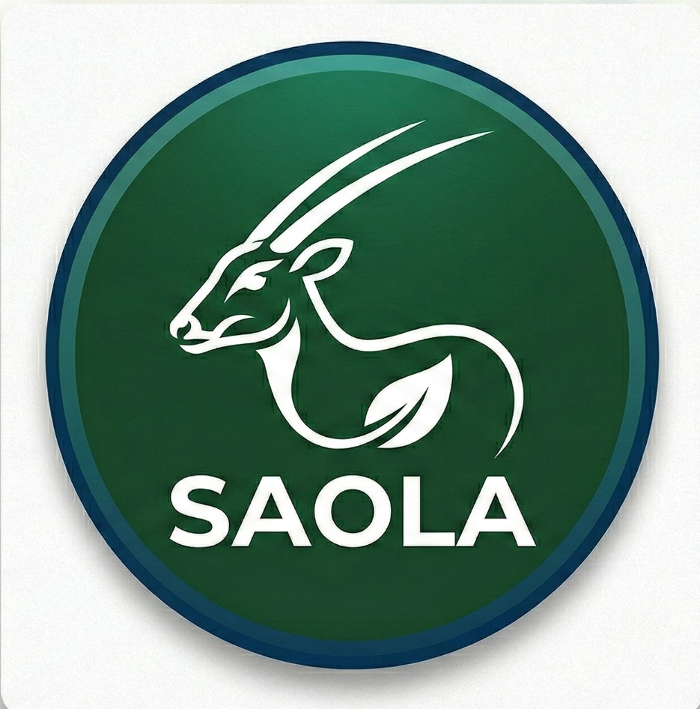

# Saola

<p align="center">
  
</p>

Secure & Private API Development Platform — cross-platform desktop API client focused on **privacy, speed, and user-owned data**.

## Phases (from agent.md)

- **Phase 1:** Core Runner — Sidebar, Request Tabs, Request Builder, CodeMirror ✅
- **Phase 2:** Storage Bridge — S3 config, Sync stubs, Storage settings ✅
- **Phase 3:** E2EE — AES-256-GCM, Master Password workflow ✅
- **Phase 4:** Global Search (Cmd+P), Postman import, Conflict resolution UI ✅

## Tech Stack

- **Frontend:** React + TypeScript + Vite
- **Backend:** Tauri 2 + Rust
- **Request engine:** reqwest (rustls)
- **E2EE:** aes-gcm

## macOS note

- **"Not supported on this Mac"** — Use **aarch64** for Apple Silicon (M1/M2/M3), **x64** for Intel.
- **"Cannot be verified"** — Right-click → **Open** → **Open**. Or use **System Settings** → **Privacy & Security** → **Open Anyway**.

## Quick Start

### Run in browser (dev, no Tauri)

```bash
npm install && npm run dev
```

Open http://localhost:5173. Uses `fetch` for HTTP.

### Run as Tauri desktop app

**Linux** — install system deps first:

```bash
sudo apt install libwebkit2gtk-4.1-dev build-essential curl wget file libxdo-dev libssl-dev libayatana-appindicator3-dev librsvg2-dev
```

Then:

```bash
npm run tauri:dev
```

## Keyboard shortcuts

- **Cmd/Ctrl + Enter** — Send request
- **Cmd/Ctrl + \\** — Toggle sidebar
- **Cmd/Ctrl + P** — Global search

## Structure

- `src/` — React frontend
- `src-tauri/src/` — Rust backend (commands, services, models per tauri-rust-best-practices)
